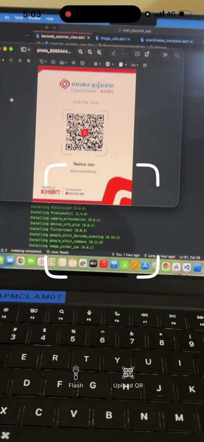

# flutter_barcode_scanner_animation

Flutter package designed to enhance barcode scanning experiences by integrating seamless animations with live camera feed. Utilizing the device camera and Google ML Kit's barcode scanning capabilities, this package provides an intuitive and efficient way to automatically zoom in on barcodes, making detection faster and more reliable. The package features smooth auto-zoom animations that dynamically adjust focus as the barcode approaches, ensuring accurate capture from the live camera feed. Perfect for developers looking to create engaging, real-time barcode scanning applications with a polished user interface and improved scanning performance.


<br>
<br>




<br>
<br>

## Features

* Supports multiple barcode formats for versatile scanning.
* Compatible with both iOS and Android platforms.
* Automatic zoom functionality to enhance accuracy when barcode size is small.
* Set focus point in camera by click on that position
* Smooth animation to capture barcode once detected during live camera feed.
* Ability to scan barcodes from uploaded images.
* Flash mode toggle for better scanning in low-light conditions.
* Customizable overlay and capture frame styles for a tailored user interface.


<br>
<br>


## Setup

### iOS

Add two rows to the `ios/Runner/Info.plist`:

* one with the key `Privacy - Camera Usage Description` and a usage description.
* and one with the key `Privacy - Microphone Usage Description` and a usage description.

If editing `Info.plist` as text, add:

```xml
<key>NSCameraUsageDescription</key>
<string>your usage description here</string>
<key>NSMicrophoneUsageDescription</key>
<string>your usage description here</string>
```

#### Requirement
- Minimum iOS Deployment Target: 15.5
- Xcode 15.3.0 or newer
- Swift 5
- ML Kit does not support 32-bit architectures (i386 and armv7). ML Kit does support 64-bit architectures (x86_64 and arm64). Check this [list](https://developer.apple.com/support/required-device-capabilities/) to see if your device has the required device capabilities. More info [here](https://developers.google.com/ml-kit/migration/ios).

Since ML Kit does not support 32-bit architectures (i386 and armv7), you need to exclude armv7 architectures in Xcode in order to run `flutter build ios` or `flutter build ipa`. More info [here](https://developers.google.com/ml-kit/migration/ios).

Go to Project > Runner > Building Settings > Excluded Architectures > Any SDK > armv7

<p align="center" width="100%">
  
</p>

Your Podfile should look like this:

```ruby
platform :ios, '15.5'  # or newer version

...

# add this line:
$iOSVersion = '15.5'  # or newer version

post_install do |installer|
  # add these lines:
  installer.pods_project.build_configurations.each do |config|
    config.build_settings["EXCLUDED_ARCHS[sdk=*]"] = "armv7"
    config.build_settings['IPHONEOS_DEPLOYMENT_TARGET'] = $iOSVersion
  end

  installer.pods_project.targets.each do |target|
    flutter_additional_ios_build_settings(target)

    # add these lines:
    target.build_configurations.each do |config|
      if Gem::Version.new($iOSVersion) > Gem::Version.new(config.build_settings['IPHONEOS_DEPLOYMENT_TARGET'])
        config.build_settings['IPHONEOS_DEPLOYMENT_TARGET'] = $iOSVersion
      end
    end

  end
end
```

Notice that the minimum `IPHONEOS_DEPLOYMENT_TARGET` is 15.5, you can set it to something newer but not older.


<br>
<br>

### Android

The endorsed [`camera_android_camerax`][2] implementation of the camera plugin built with CameraX has
better support for more devices than `camera_android`, but has some limitations; please see [this list][3]
for more details. If you wish to use the [`camera_android`][4] implementation of the camera plugin
built with Camera2 that lacks these limitations, please follow [these instructions][5].

If you wish to allow image streaming while your app is in the background, there are additional steps required;
please see [these instructions][6] for more details.

#### Requirement
- minSdkVersion: 21
- targetSdkVersion: 35
- compileSdkVersion: 35


<br>
<br>
<br>

## Usage


Sample code usage:

```dart

import 'dart:developer';
import 'dart:io';

import 'package:flutter/material.dart';
import 'package:flutter/services.dart';
import 'package:flutter_easyloading/flutter_easyloading.dart';
import 'package:vibration/vibration.dart';
import 'package:image_picker/image_picker.dart';
import 'package:flutter_barcode_scanner_animation/flutter_barcode_scanner_animation.dart';


void main() async{
  WidgetsFlutterBinding.ensureInitialized();
  runApp(const ScanBarcodeApp());
  configLoading();
}

void configLoading() {
  EasyLoading.instance
    ..displayDuration = const Duration(milliseconds: 2000)
    ..indicatorType = EasyLoadingIndicatorType.fadingCircle
    ..loadingStyle = EasyLoadingStyle.dark
    ..indicatorSize = 45.0
    ..radius = 10.0
    ..maskColor = Colors.blue.withOpacity(0.5)
    ..userInteractions = false
    ..dismissOnTap = false;
}

class ScanBarcodeApp extends StatefulWidget {
  const ScanBarcodeApp({super.key});

  @override
  State<ScanBarcodeApp> createState() => _ScanBarcodeAppState();
}

class _ScanBarcodeAppState extends State<ScanBarcodeApp> {
  @override
  Widget build(BuildContext context) {
    return MaterialApp(
      home: DefaultScreen(),
      builder: EasyLoading.init(),
    );
  }
}


class DefaultScreen extends StatefulWidget {
  const DefaultScreen({super.key});

  @override
  State<DefaultScreen> createState() => _DefaultScreenState();
}

class _DefaultScreenState extends State<DefaultScreen> {

  Barcode? _barcode;
  final barcodeScanner = BarcodeScanner();
   List<Uint8List> croppedImages = [];
   
  void _handleOpenScanBarcode() async {
    _barcode = await Navigator.push(
      context, 
      MaterialPageRoute(
        builder: (context) => Scaffold(body: BarcodeScannerDemoPage())
      )
    );
    setState(() {});
  }

  @override
  Widget build(BuildContext context) {

    log("size == ${MediaQuery.of(context).size}");
    return PopScope(
      canPop: false,
      child: Scaffold(
        appBar: AppBar(
        title: Text("Flutter Barcode Scanner Animation"),
        backgroundColor: Color(0xFF035F9E),
        foregroundColor: Colors.white,
      ),
        body: Center(
          child: Padding(
            padding: const EdgeInsets.all(20.0),
            child: Column(
              mainAxisSize: MainAxisSize.min,
              spacing: 20,
              children: [
            
                if(_barcode != null)
                  ...[
                    Text("type = ${_barcode!.type}"),
                    Text("type = ${_barcode!.format}"),
                    Text("rawValue = ${_barcode!.rawValue}"),
                  ],

                ElevatedButton(
                  onPressed: _handleOpenScanBarcode,
                  style: ElevatedButton.styleFrom(
                    backgroundColor: Color(0xFF035F9E),
                    foregroundColor: Colors.white,
                    padding: EdgeInsets.symmetric(vertical: 12,horizontal: 25)
                  ),
                  child: Text("Scan Barcode")
                )
              ],
            ),
          ),
        ),
      ),
    );
  }
}

class BarcodeScannerDemoPage extends StatefulWidget {
  const BarcodeScannerDemoPage({super.key});

  @override
  State<BarcodeScannerDemoPage> createState() => _BarcodeScannerDemoPageState();
}

class _BarcodeScannerDemoPageState extends State<BarcodeScannerDemoPage> {

  final BarcodeScannerController _controller = BarcodeScannerController();

  @override
  void dispose() {
    super.dispose();
    _controller.dispose();
  }

  @override
  Widget build(BuildContext context) {
    return Scaffold(
      body: BarcodeScannerView(
        controller: _controller,
        onDetected: _onDetected,
        onCompleted: _onComplete,
        // barcodeFrameViewBuilder: (context, rect,barcode){
        //   return Container(
        //     decoration: BoxDecoration(
        //       border: Border.all(width: 1,color: Colors.white),
        //       borderRadius: BorderRadius.circular(20)
        //     ),
        //     child: barcode == null
        //       ? null
        //       : Text(
        //         'barcode format : ${barcode.format}',
        //         style: TextStyle(fontSize: 10,color: Colors.white),
        //       ),
        //   );
        // },
        // animation: BarcodeScannerAnimation(duration: Duration(milliseconds: 200),curve: Curves.ease),
        // barcodeScanFrameSize: Size(250, 250),
        children: [
          Positioned(
            top: 70,
            left: 0,
            right: 0,
            child: Align(
              alignment: AlignmentGeometry.center,
              child: Text(
                "Scan Barcode Demo",
                style: TextStyle(
                  color: Colors.white,
                  fontSize : 20,
                  fontWeight: FontWeight.w600
                )
              ),
            ),
          ),
          Positioned(
            left: 0,
            right: 0,
            bottom: 50,
            child: Row(
              mainAxisAlignment: MainAxisAlignment.center,
              spacing: 25,
              children: [

                IconButton(
                  onPressed: _toggleFlash, 
                  style: IconButton.styleFrom(
                    backgroundColor: Color(0xFF035F9E),
                    foregroundColor: Colors.white
                  ),
                  icon: Icon(Icons.flash_on)
                ),

                IconButton(
                  onPressed: _uploadBarcode, 
                  style: IconButton.styleFrom(
                    backgroundColor: Color(0xFF035F9E),
                    foregroundColor: Colors.white
                  ),
                  icon: Icon(Icons.qr_code)
                ),
              ],
            ),
          ),
        ]
      )
    );
  }

  void _onDetected(List<Barcode> barcodes){
    Vibration.vibrate();
    for (var element in barcodes) {
      log("$element");
    }
    // call api
  }
  void _onComplete() async {
    await _loadFakeData();
    await _controller.resume();
  }

  Future<void> _toggleFlash() async {
    _controller.setFlashMode(
      _controller.flashMode == FlashMode.torch
        ? FlashMode.off 
        : FlashMode.torch
    );
  }

  void _uploadBarcode() async {

    await _controller.pause();

    final xFile = await ImagePicker().pickImage(
      source: ImageSource.gallery,
      imageQuality: 70,
    );
    if(xFile == null) {
      await _controller.resume();
      return ;
    }

    final barcodes = await _controller.detectBarcodeFromFile(File(xFile.path));
    if(barcodes.isNotEmpty){
      log("barcodes found == ${barcodes.length}");
      for(final barcode in barcodes){
        log("barcode.rawValue == ${barcode.rawValue}");
      }
      // await _loadFakeData();
      // await _controller.resume();
      if(mounted){
        Navigator.pop(context,barcodes.first);
      }
    }else {
      await _controller.resume();
      EasyLoading.showToast(
        "No barcode found in image!.",
        duration: Duration(seconds: 3)
      );
    }
    

  }

  Future<void> _loadFakeData({Duration duration = const Duration(seconds: 2)}) async{
    // show loading
    EasyLoading.show(
      status: 'Loading...',
      maskType: EasyLoadingMaskType.black,
    );

    // fake api request
    await Future.delayed(duration);

    // resume camera and detector
    await _controller.resume();

    EasyLoading.dismiss();
    EasyLoading.showToast(
      "Invalid barcode!.",
      duration: Duration(seconds: 3)
    );

  }
}

```


<br>
<br>
<br>
<br>

## 📬 Contact

If you have any questions, suggestions, or issues, feel free to reach out via my website:

👉 [Website](https://horleng.vercel.app)
